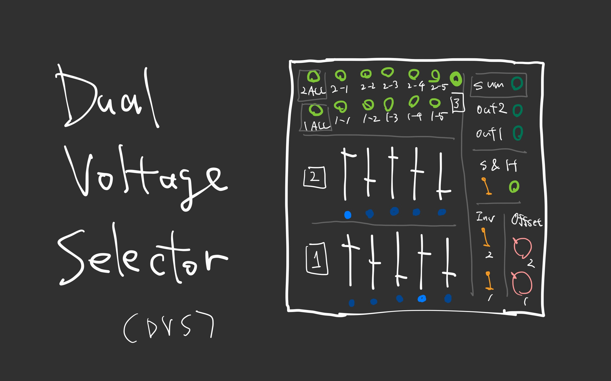
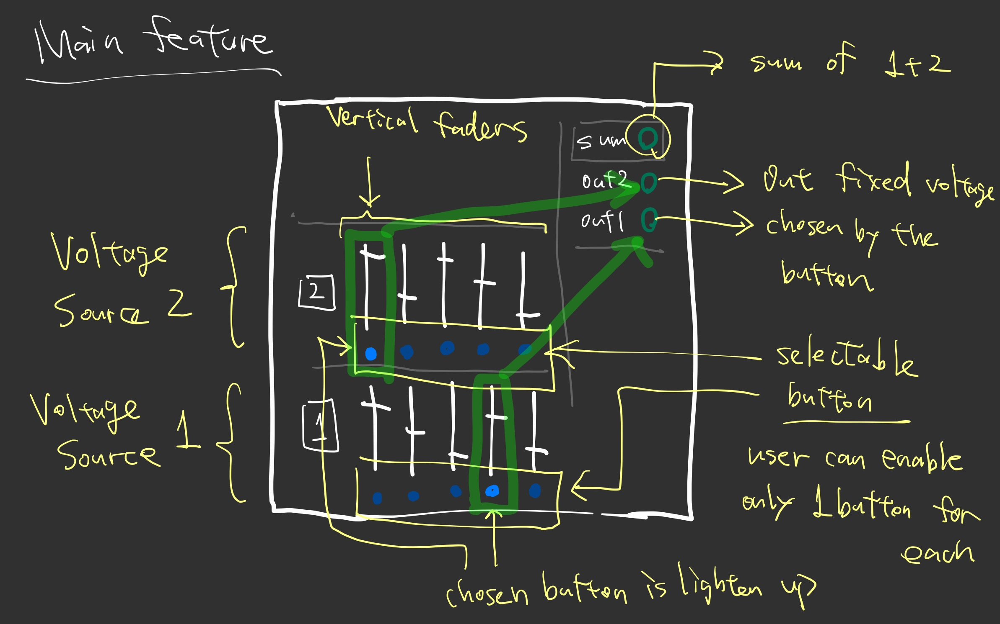
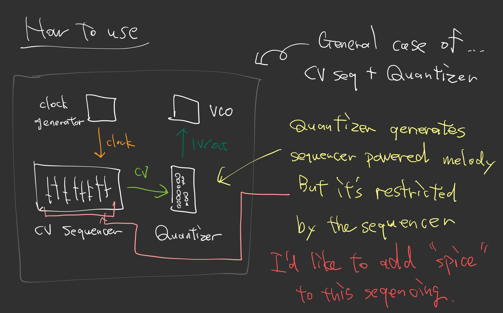
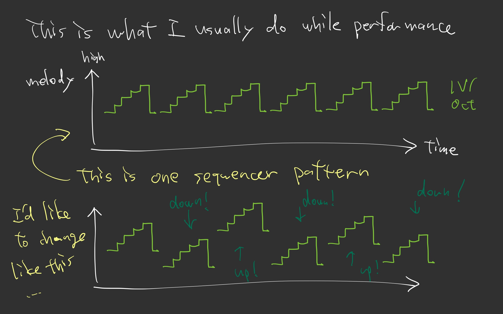
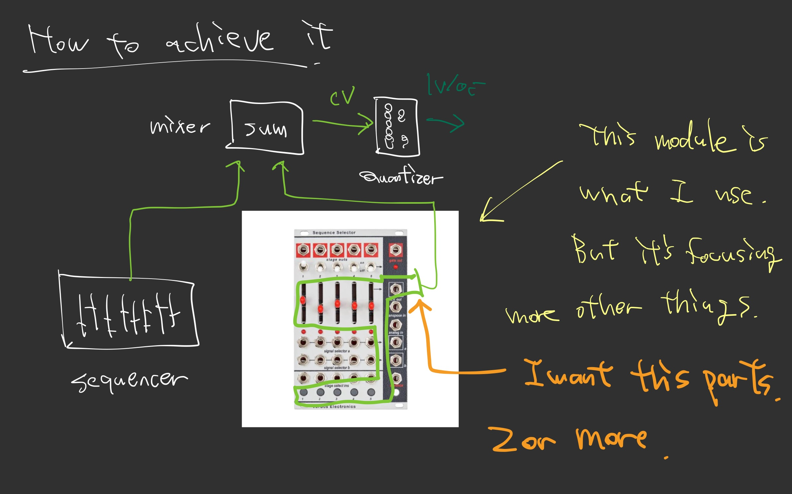
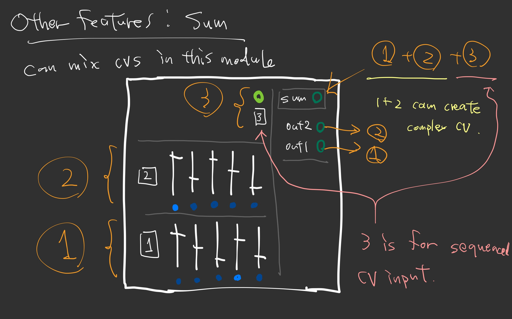
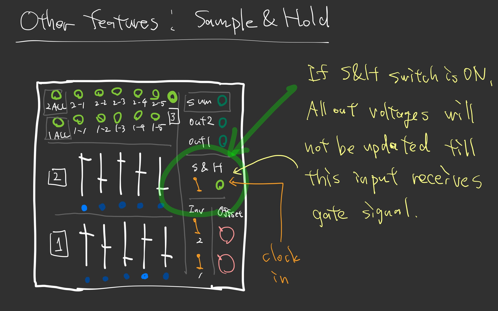
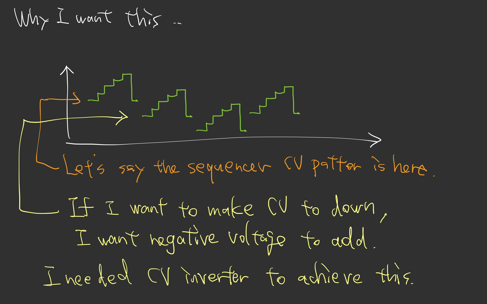
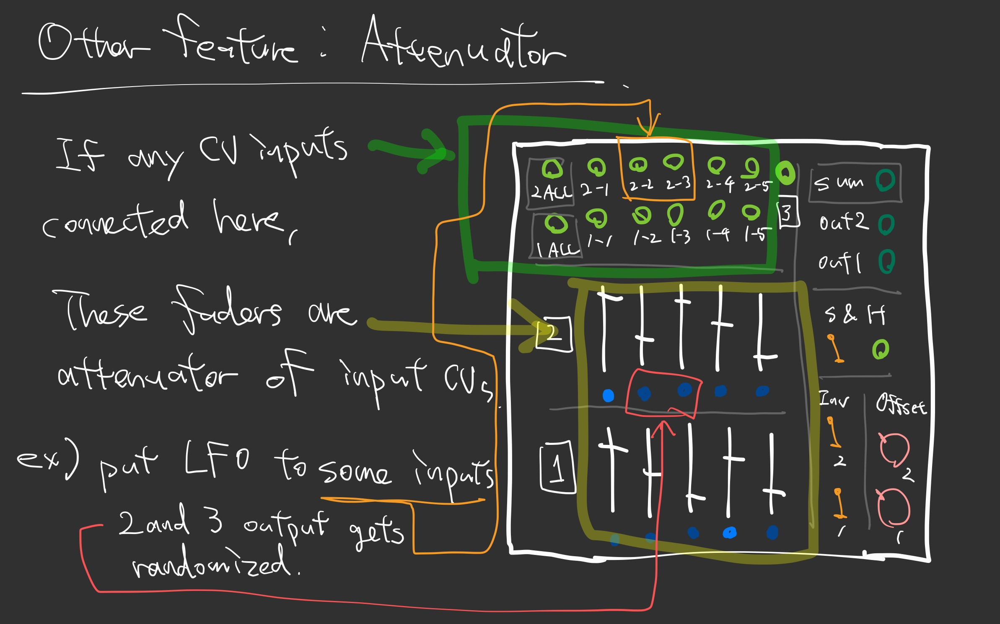

# Dual Voltage Selector

performance ref: https://youtu.be/zATNgde9VzU?si=H2_rsMa0ExHrCztm

[ADDAC 203](https://www.addacsystem.com/en/products/modules/addac200-series/addac203-rev02) as fixed voltage source, [ADDAC 305](https://www.addacsystem.com/en/products/modules/addac300-series/addac305) as toggle switches of the fixed voltages.

